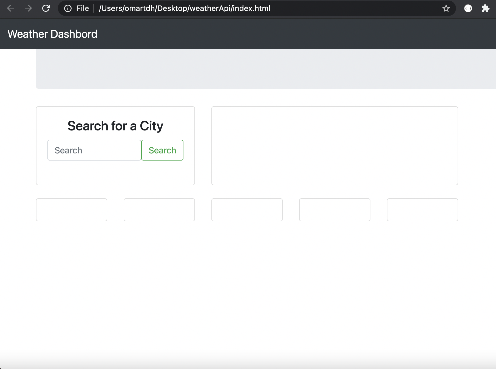

# weatherApi

## File

* [`Weather-Dashbord`](index.html)

* Created a web app from scratch that allow user to check current and futuer weather in any city in the world, up to 5 days in future.

* Created the JavaScript logic that will allow the used to input a city name into the search bar, based on that city input the current forcast will show up as well as 5 days in the future.

;

;